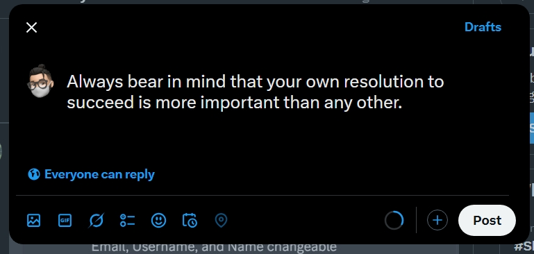

# Random Quote Generator

This project allow users to generate radom quote giving different features like fetching new quote, copy to clipboard, share on twitter and export quote card and image in device;

## Table of Contents

- [Random Quote Generator](#random-quote-generator)
  - [Table of Contents](#table-of-contents)
  - [Deployment](#deployment)
  - [Features](#features)
  - [Technologies Used](#technologies-used)
  - [Installation](#installation)
  - [Usage](#usage)
  - [Note](#note)

## Deployment

- **Live link**: https://quote-generator-one-lemon.vercel.app

## Features

- **Responsive Design**: The project adjusts its layout based on the screen size, ensuring a great user experience on both desktop and mobile devices.
- **Modern UI**: Clean and visually appealing design using the Poppins font.
- **Interactive Elements**: Users can interact through different mood emoji.

## Technologies Used

- **HTML5**: For the structure of the project.
- **CSS3**: For styling and responsive design.
- **JavaScript**: For interactive elements.
- **HTML2CANVAS Plugin**: Utilizes the html2canvas.js plugin for exporting html as image.

## Installation

1. Clone the repository:
   ```bash
   git clone https://github.com/Depkstha/quote-generator.git
   ```

2. Navigate into the project directory:
   ```bash
   cd quote-generator
   ```

3. Open `index.html` in your web browser to view the project.

## Usage

- The quote generator can generate random quote and user can share it in different platform.

## This is what it looks like




## Note
This project is part of the fulfillment of an assignment provided by Cohort on Masterji. Thank you Hitesh sir, Piyush sir, TA's and entire team for running such wonderful cohort successfully. I am very happy that I can be part of it. Love and support from Nepal.
