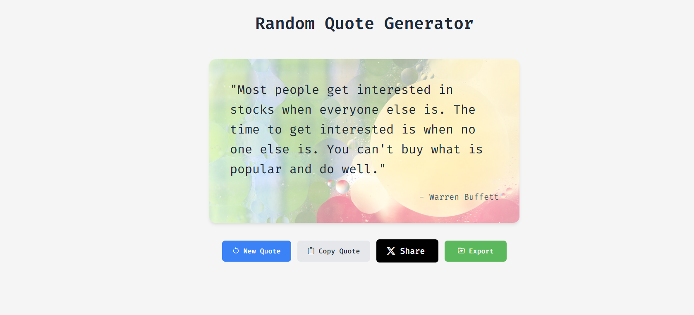

# Random Quote Generator

This project allows users to generate random quotes with various features like fetching new quotes, copying to clipboard, sharing on Twitter, and exporting quote cards as images.

## Table of Contents

- [Random Quote Generator](#random-quote-generator)
  - [Table of Contents](#table-of-contents)
  - [Deployment](#deployment)
  - [Features](#features)
  - [Technologies Used](#technologies-used)
  - [Installation](#installation)
  - [Preview](#preview)
  - [Acknowledgement](#acknowledgement)

## Deployment

- **Live link**: https://quote-generator-one-lemon.vercel.app

## Features

- **Responsive Design**: The project adjusts its layout based on the screen size, ensuring a great user experience on both desktop and mobile devices.
- **Modern UI**: Clean and visually appealing design using the Poppins font.
- **Interactive Elements**: Users can interact through buttons to perform different actions.
- **Quote Sharing**: Users can share quotes on different platforms.
- **Copy to Clipboard**: Allows users to copy the quote text easily.
- **Export as Image**: Uses the html2canvas.js plugin to save quotes as images.

## Technologies Used

- **HTML5**: For the structure of the project.
- **CSS3**: For styling and responsive design.
- **JavaScript**: For interactive elements.
- **HTML2CANVAS Plugin**: Utilizes the html2canvas.js plugin for exporting html as image.

## Installation

1. Clone the repository:
   ```bash
   git clone https://github.com/Depkstha/quote-generator.git
   ```

2. Navigate into the project directory:
   ```bash
   cd quote-generator
   ```

3. Open `index.html` in your web browser to view the project.

## Preview
This is what it looks like



## Acknowledgement
This project is part of the fulfillment of an assignment provided by Cohort on Masterji. Thank you Hitesh sir, Piyush sir, TAs, and the entire team for running such a wonderful cohort successfully. I am very happy to be part of it. Love and support from Nepal.
